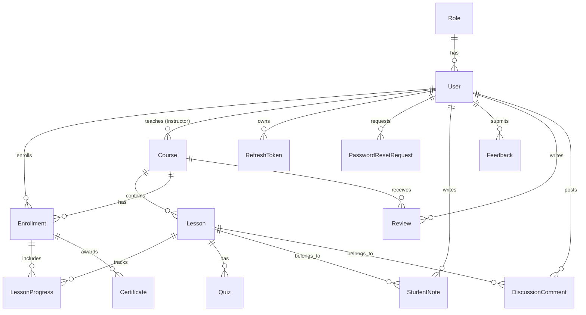

# BrightLearn LMS - Backend Documentation

This document provides a comprehensive technical overview of the BrightLearn Learning Management System (LMS) backend. It is designed to be easily parsed and understood by LLMs and human developers alike.

---

## 1. Technical Stack

*   **Runtime:** Java 21
*   **Framework:** Spring Boot 3.4.5 (Spring MVC, Spring Security, Spring Data JPA)
*   **Database:** MySQL (via Hibernate ORM)
*   **Security:** Stateless JWT Auth + Refresh Token rotation
*   **Documentation:** Springdoc OpenAPI / Swagger UI
*   **Build Tool:** Maven

---

## 2. Directory & Package Structure

The backend code is situated under `src/main/java/com/brightlearn/`:

```text
com.brightlearn/
│
├── BrightlearnBackendApplication.java    # Application entry point & @EnableJpaAuditing
│
├── audit/                                # Audit logging framework
│   ├── AuditAspect.java                  # AOP interceptor logging user actions to DB
│   └── Audited.java                      # Custom annotation to mark audited service methods
│
├── config/                               # Core configurations
│   ├── CorsConfig.java                   # CORS mapping allowing frontend access
│   ├── DataInitializer.java              # Populates roles, admin, courses on start
│   └── OpenApiConfig.java                # Swagger OpenAPI specification config
│
├── security/                             # Authentication and security configuration
│   ├── JwtAuthenticationFilter.java      # Processes incoming JWT in Authorization headers
│   ├── JwtService.java                   # Logic for generating/validating access/refresh tokens
│   └── SecurityConfig.java               # Security Filter Chain, role access rules, password encoder
│
├── entity/                               # JPA Database entities
│   ├── User.java                         # User details (Student, Instructor, Admin)
│   ├── Role.java                         # Authority mapping (ROLE_STUDENT, ROLE_INSTRUCTOR, ROLE_ADMIN)
│   ├── RefreshToken.java                 # Rotation storage for refresh tokens
│   ├── Course.java                       # Courses containing lessons, reviews, and quizes
│   ├── Lesson.java                       # Video/Text/Quiz course modules
│   ├── LessonProgress.java               # Tracking if/when a student completed a lesson
│   ├── Enrollment.java                   # Bridge table between User and Course with status & grade
│   ├── Quiz.java                         # Questions/Answers mapping for course validation
│   ├── QuizAttempt.java                  # Legacy/unused stub
│   ├── StudentNote.java                  # Interactive student notes per lesson
│   ├── Feedback.java                     # Feedback/contact requests from users
│   ├── Review.java                       # Star rating and comment reviews for courses
│   ├── DiscussionComment.java            # Threaded lesson comments for student/instructor communication
│   ├── AuditLog.java                     # Log of security/critical actions
│   └── PasswordResetRequest.java         # Token verification for reset password flows
│
├── repository/                           # Spring Data JPA repositories
│   └── [Entity]Repository.java           # DB query declarations (e.g. UserRepository, CourseRepository, etc.)
│
├── dto/                                  # Data Transfer Objects (Requests and Responses)
│   ├── AuthRequest/Response              # Auth credentials and tokens DTOs
│   ├── UserResponse                      # User profile mappings
│   ├── CourseCreateRequest/Response      # Course administration DTOs
│   └── ...                               # Other endpoints input/output representations
│
├── controller/                           # REST Controllers (API Endpoints)
│   └── [Feature]Controller.java          # REST mappings with @RestController
│
├── service/                              # Service Layer containing business logic
│   └── [Feature]Service.java             # Transactions, database interactions, logic processing
│
└── exception/                            # Global exception handling
    ├── GlobalExceptionHandler.java       # Catches standard & custom exceptions, outputs structured JSON
    └── CustomExceptions                  # RuntimeException sub-classes (e.g., ResourceNotFoundException)
```

---

## 3. Database Schema & Entity Relationships

The relational database schema is structured as follows:



### Key Entity Definitions

1.  **User (`users`)**: Fields: `id`, `name`, `email`, `password` (hashed), `role` (ManyToOne to Role), `active`.
2.  **Role (`roles`)**: Contains role types: `ROLE_STUDENT`, `ROLE_INSTRUCTOR`, `ROLE_ADMIN`.
3.  **Course (`courses`)**: Fields: `id`, `title`, `description`, `category`, `imageUrl`, `difficulty` (BEGINNER/INTERMEDIATE/ADVANCED), `instructor` (ManyToOne to User).
4.  **Lesson (`lessons`)**: Fields: `id`, `title`, `content` (text content or video URL), `type` (VIDEO/TEXT/QUIZ), `orderIndex`, `course` (ManyToOne to Course).
5.  **Quiz (`quizzes`)**: Contains JSON/Text representing questions, options, correct options, associated with a Quiz lesson.
6.  **LessonProgress (`lesson_progress`)**: Fields: `id`, `enrollment` (ManyToOne to Enrollment), `lesson` (ManyToOne to Lesson), `completed` (boolean), `completedAt` (timestamp).
7.  **Enrollment (`enrollments`)**: Fields: `id`, `student` (ManyToOne to User), `course` (ManyToOne to Course), `status` (ACTIVE/COMPLETED), `progressPercentage` (double), `completedAt`, `grade` (double).
8.  **Certificate (`certificates`)**: Fields: `id`, `certificateCode` (UUID string), `enrollment` (OneToOne to Enrollment), `issuedAt`.
9.  **StudentNote (`student_notes`)**: Fields: `id`, `student` (ManyToOne to User), `lesson` (ManyToOne to Lesson), `content` (text), `updatedAt`.
10. **DiscussionComment (`discussion_comments`)**: Fields: `id`, `lesson` (ManyToOne to Lesson), `user` (ManyToOne to User), `content` (text), `createdAt`. Supports nested comment responses (optional or parent-child hierarchy in entity).
11. **AuditLog (`audit_logs`)**: Fields: `id`, `userId`, `action` (string description), `details` (metadata), `ipAddress`, `timestamp`.

---

## 4. Authentication & Security Flow

Security is configured in [SecurityConfig.java](file:///c:/Users/vallabh.kulakarni1/project/brightlearn-backend/src/main/java/com/brightlearn/config/SecurityConfig.java).

```text
Incoming REST Request
       │
       ▼
┌────────────────────────┐
│ JwtAuthenticationFilter│ ──(Token invalid/missing)──► Pass through anonymously
└────────────────────────┘
       │ (Token valid)
       ▼
┌────────────────────────┐
│SecurityContextHolder   │ ──(Loads Authentication object with user details & Role authorities)
└────────────────────────┘
       │
       ▼
┌────────────────────────┐
│ Authorization Rules    │ ──(Throws AccessDeniedException if user lacks required role)
└────────────────────────┘
```

*   **Access Token:** Expired after **15 minutes**. Signed using `HMAC-SHA256` with a security key. Contains the user `id`, `email`, and `role`.
*   **Refresh Token:** Expired after **7 days**. Stored in the database (`refresh_tokens` table) with rotation. When a client requests `/auth/refresh`, the old refresh token is deleted/updated, and a new set of Access + Refresh tokens is returned.
*   **Public Access:** Swagger UI, `/v3/api-docs/**`, `/auth/**` (login, signup, refresh, reset password), and `/certificates/verify/**` are public endpoints.

---

## 5. API Endpoints Mapping

All API endpoints are prefixed with the base server URL (default: `http://localhost:8080/`). There is no prefix like `/api`.

### 5.1 Authentication (`/auth`)
*   `POST /auth/signup` - Register a new user (default role: `ROLE_STUDENT`, or selected role).
*   `POST /auth/login` - Authenticates user. Returns access token, refresh token, and user profile metadata.
*   `POST /auth/refresh` - Swap a valid refresh token for a new access & refresh token pair.
*   `POST /auth/logout` - Invalidate and delete the active refresh token.
*   `POST /auth/forgot-password` - Requests reset email (saves reset token).
*   `POST /auth/reset-password` - Resets password using valid token.

### 5.2 Admin Administration (`/admin`)
*Requires `ROLE_ADMIN` authority*
*   `GET /admin/users` - Get list of all registered users.
*   `PUT /admin/users/{userId}/role` - Change a user's role.
*   `PUT /admin/users/{userId}/toggle-active` - Suspend or reactivate user account.
*   `GET /admin/stats` - Overall system-wide platform statistics.

### 5.3 Course Directory (`/courses`)
*   `GET /courses` - Get all available courses (supports search and categories). *Public/All Roles*
*   `POST /courses` - Create a course. *Instructor*
*   `GET /courses/{id}` - Get single course details (with lessons, reviews). *All Roles*
*   `PUT /courses/{id}` - Update course parameters. *Instructor (Owner) / Admin*
*   `DELETE /courses/{id}` - Delete course. *Instructor (Owner) / Admin*

### 5.4 Enrollment System (`/enrollments`)
*   `POST /enrollments/enroll/{courseId}` - Enroll the logged-in student in a course. *Student*
*   `GET /enrollments/my-enrollments` - Get courses logged-in user is currently enrolled in. *Student*
*   `GET /enrollments/course/{courseId}` - Get enrollment status of active user in specific course. *Student*

### 5.5 Progress & Lesson Navigation (`/progress`, `/lessons`)
*   `POST /progress/lessons/{lessonId}/complete` - Mark a lesson completed. Calculates overall course percentage. *Student*
*   `GET /progress/course/{courseId}` - Get lesson completion grid for active user in specific course. *Student*
*   `POST /lessons` - Create a new lesson. *Instructor*
*   `PUT /lessons/{id}` - Edit lesson parameters. *Instructor*
*   `DELETE /lessons/{id}` - Delete a lesson. *Instructor*

### 5.6 Quiz Execution (`/quizzes`)
*   `GET /quizzes/lesson/{lessonId}` - Fetch quiz questions associated with lesson. *Student/Instructor*
*   `POST /quizzes/lesson/{lessonId}/submit` - Submit answers. Returns correctness matrix and score. *Student*

### 5.7 Student Notes (`/notes`)
*   `GET /notes/lesson/{lessonId}` - Retrieve user notes for a lesson. *Student*
*   `POST /notes/lesson/{lessonId}` - Save/update user notes. *Student*

### 5.8 Certification Engine (`/certificates`)
*   `GET /certificates/verify/{certificateCode}` - Validate legitimacy of a certificate and return public verification details. *Public*
*   `GET /certificates/enrollment/{enrollmentId}` - Fetch certificate corresponding to an enrollment (generates automatically if progress = 100%). *Student*

### 5.9 Discussions & Forums (`/discussion`)
*   `GET /discussion/lesson/{lessonId}` - Fetch comment threads for a lesson. *Student/Instructor/Admin*
*   `POST /discussion/lesson/{lessonId}` - Create a new discussion comment. *Student/Instructor/Admin*

### 5.10 Platform Feedback (`/feedback`)
*   `POST /feedback` - Submit user feedback, suggestions, bug reports, or contact forms. *Public/All Roles*
*   `GET /feedback` - View all submitted feedbacks. *Admin*

### 5.11 Course Reviews (`/reviews`)
*   `POST /reviews/course/{courseId}` - Post star rating + description for a course. *Student*
*   `GET /reviews/course/{courseId}` - Retrieve all public reviews of a course. *Public/All*

### 5.12 Platform Activity Logging (`/audit`)
*Requires `ROLE_ADMIN` authority*
*   `GET /audit` - Returns logs captured via `@Audited` AOP aspect.

---

## 6. Core Business Logics

### 6.1 Enrollment & Progress Tracking
When a student triggers `POST /progress/lessons/{lessonId}/complete`, the `ProgressService`:
1.  Creates/updates the `LessonProgress` record as `completed = true`.
2.  Queries the total count of lessons in the Course vs. the completed lessons in `LessonProgress` under that specific `Enrollment`.
3.  Updates `progressPercentage` on the `Enrollment`.
4.  If progress reaches `100.0%`, sets enrollment status to `COMPLETED`, saves `completedAt` timestamp, and triggers `CertificateService` to issue a Certificate with a unique code.

### 6.2 Audit Aspect
The `AuditAspect` is an AOP configuration checking for methods decorated with `@Audited(action = "ACTION_NAME")`. When intercepted:
*   It grabs current user context from `SecurityContextHolder`.
*   Records transaction metadata, client IP address, and operation status.
*   Writes a record to the `audit_logs` table asynchronously or transactional.

---

## 7. Setup & Run Instructions

### Prerequisites
*   Java Development Kit (JDK) 21
*   Maven 3.x
*   MySQL Server

### Configuration
Update settings in `src/main/resources/application.properties` (or custom profile):
```properties
spring.datasource.url=jdbc:mysql://localhost:3306/brightlearn?createDatabaseIfNotExist=true
spring.datasource.username=root
spring.datasource.password=yourpassword
spring.jpa.hibernate.ddl-auto=update
jwt.secret=your_super_secret_high_entropy_signing_key_32_bytes_or_more
```

### Running the App
Use the Maven wrapper:
```powershell
# Windows
.\mvnw.cmd spring-boot:run

# Unix
./mvnw spring-boot:run
```
Once run, the Swagger documentation is accessible at `http://localhost:8080/swagger-ui/index.html`.
